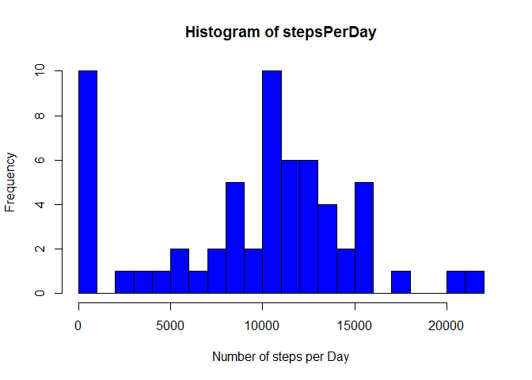
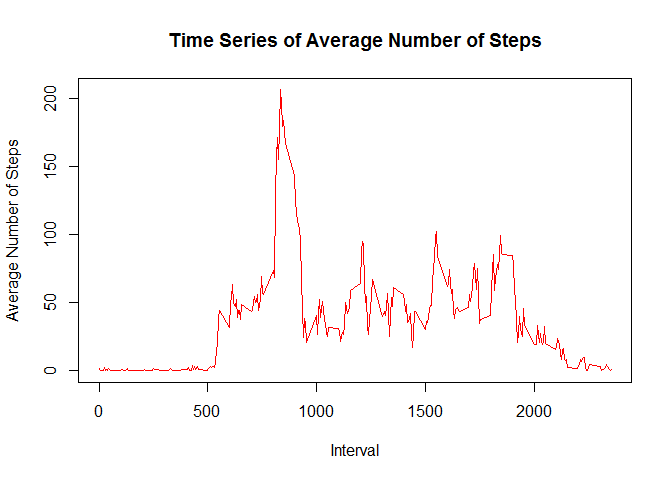
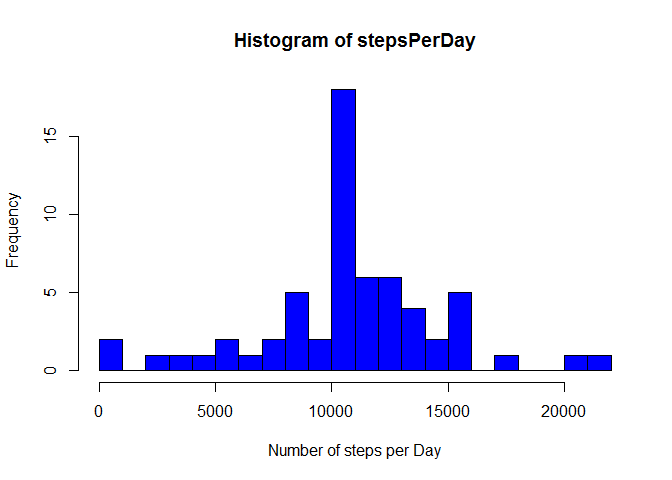
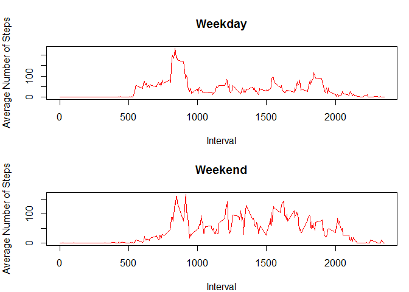

# Reproducible Research: Peer Assessment 1


## Loading and preprocessing the data

First at all, we load the data:


```r
activity <- read.csv("../Data/activity.csv")
```

We look at the structure of the data.


```r
str(activity)
```

```
## 'data.frame':	17568 obs. of  3 variables:
##  $ steps   : int  NA NA NA NA NA NA NA NA NA NA ...
##  $ date    : Factor w/ 61 levels "2012-10-01","2012-10-02",..: 1 1 1 1 1 1 1 1 1 1 ...
##  $ interval: int  0 5 10 15 20 25 30 35 40 45 ...
```

It is not necessary process the data.

## What is mean total number of steps taken per day?

We make a histogram with the total number of steps taken per day. First, we calculate the total number of steps taken per day:


```r
stepsPerDay <- tapply(activity$steps, activity$date, sum, na.rm=TRUE)
```

We ignore the NA values. We look at how it looks like:


```r
head(stepsPerDay)
```

```
## 2012-10-01 2012-10-02 2012-10-03 2012-10-04 2012-10-05 2012-10-06 
##          0        126      11352      12116      13294      15420
```

We make a histogram:


```r
hist(stepsPerDay, 30, col= "blue", xlab= "Number of steps per Day")
```

 

With the histogram is not possible to tell what is the value of mean or the median. The median is possible to be between 0-1000 or 10000-11000. We cannot to tell anything about the mean. We calculate:


```r
mean(stepsPerDay)
```

```
## [1] 9354.23
```

```r
median(stepsPerDay)
```

```
## [1] 10395
```

## What is the average daily activity pattern?

We calculate the average number of steps for each interval, averaged across all days:


```r
stepsPerInterval <- tapply(activity$steps, activity$interval, mean, na.rm=TRUE)
```
We look at how it looks like:


```r
head(stepsPerInterval)
```

```
##         0         5        10        15        20        25 
## 1.7169811 0.3396226 0.1320755 0.1509434 0.0754717 2.0943396
```

We make a plot of time series:


```r
plot(names(stepsPerInterval), stepsPerInterval, type="l", col="red", main="Time Series of Average Number of Steps", xlab="Interval", ylab= "Average Number of Steps")
```

 

We calculate more precisely the interval with more activity:


```r
stepsPerInterval[which.max(stepsPerInterval)]
```

```
##      835 
## 206.1698
```

At 8:35 hours is the interval of 5 minutes which is maximun the numbers of steps, in average.

## Imputing missing values

We observe that the total numbers of steps is biased by the NA values. We imputing the missing values and create a new data set with missing data filled in.

First, we calculate the number of miising values:


```r
summary(activity)
```

```
##      steps                date          interval     
##  Min.   :  0.00   2012-10-01:  288   Min.   :   0.0  
##  1st Qu.:  0.00   2012-10-02:  288   1st Qu.: 588.8  
##  Median :  0.00   2012-10-03:  288   Median :1177.5  
##  Mean   : 37.38   2012-10-04:  288   Mean   :1177.5  
##  3rd Qu.: 12.00   2012-10-05:  288   3rd Qu.:1766.2  
##  Max.   :806.00   2012-10-06:  288   Max.   :2355.0  
##  NA's   :2304     (Other)   :15840
```

There are 2304 missing data in the steps value. We fill in the missing data with the mean of 5 minutes interval. For that, we write the following script:


```r
average <- tapply(activity$steps, activity$interval, mean, na.rm=TRUE)


missing <- is.na(activity$steps)
interval <- as.character(activity$interval[missing])

n <- 0

for (i in 1:length(missing)){
        if (missing[i]==TRUE){
                n <- n+1
                activity$steps[i] <- average[[interval[n]]]
                }
}
write.csv(activity, "~/Data Science/5_Reproducible Research/Data/imputed.csv", row.names=FALSE)
```

We have created a new data set called ```imputed```.

As we did in the first part, we calculated the total number of steps:


```r
imputed <- read.csv("~/Data Science/5_Reproducible Research/Data/imputed.csv")
stepsPerDay <- tapply(imputed$steps, imputed$date, sum)
```

And we create the histogram:


```r
hist(stepsPerDay, 30, col= "blue", xlab= "Number of steps per Day")
```

 

Now we observe that the median is betwen 10000 and 11000, and the mean must be close to the median. We calculate


```r
mean(stepsPerDay)
```

```
## [1] 10766.19
```

```r
median(stepsPerDay)
```

```
## [1] 10766.19
```

Luckily, the mean and median are the same. Filling the missing values, we unbias the data and there is no more 0 values for number of steps. By this way we correct the value of the mean and it is higher than in the first part.

## Are there differences in activity patterns between weekdays and weekends?

We work with the imputed data set. We create a new variable called ```weekday``` as a factor variale with two levels **weekday** and **weekend**:


```r
Sys.setlocale("LC_TIME", "English")
```

```
## [1] "English_United States.1252"
```


```r
imputed$Day.Name <-as.factor(weekdays(as.Date(imputed$date)))
levels(imputed$Day.Name) <- list(weekday=c("Monday", "Tuesday", "Wednesday", "Thursday", "Friday"), weekend=c("Saturday", "Sunday" ))
```

We subset the data set into two data sets, one for the weedays and one for the weekend:


```r
weekday <- subset(imputed, Day.Name=="weekday")

weekend <- subset(imputed, Day.Name=="weekend")
```

As we did in the second part, we calculate the average number of steps for each interval, averaged across all days:


```r
weekdayActivity <- tapply(weekday$steps, weekday$interval, mean)

weekendActivity <- tapply(weekend$steps, weekend$interval, mean)
```


And we create a panel plot:

```r
par(mfcol=c(2,1), mar=c(4,4,4,1))
plot(names(weekdayActivity), weekdayActivity, type="l", col="red", main="Weekday", xlab="Interval", ylab="Average Number of Steps")
plot(names(weekendActivity), weekendActivity, type="l", col="red", main="Weekend", xlab="Interval", ylab="Average Number of Steps")
```

 

We observe that there are differeces beetwen the weekday activity and weekend activity, On weekday the activity is concentrated at the first hours of the day. On weekend there is more activity across all the day. 
